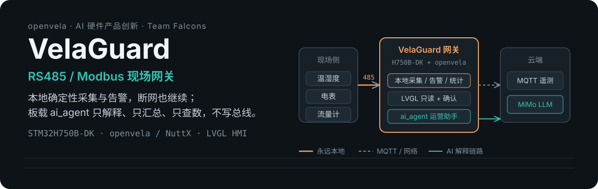
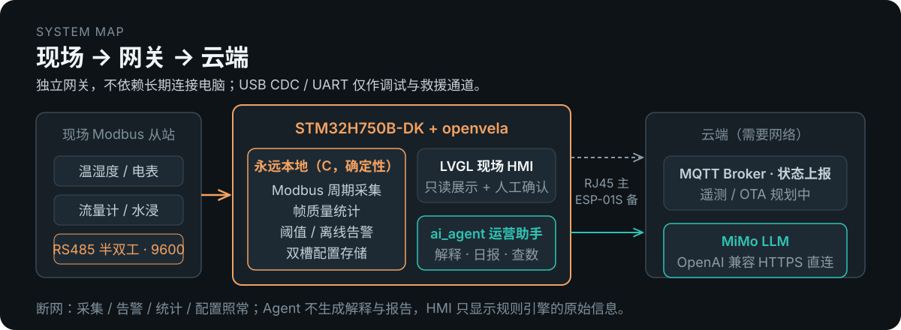
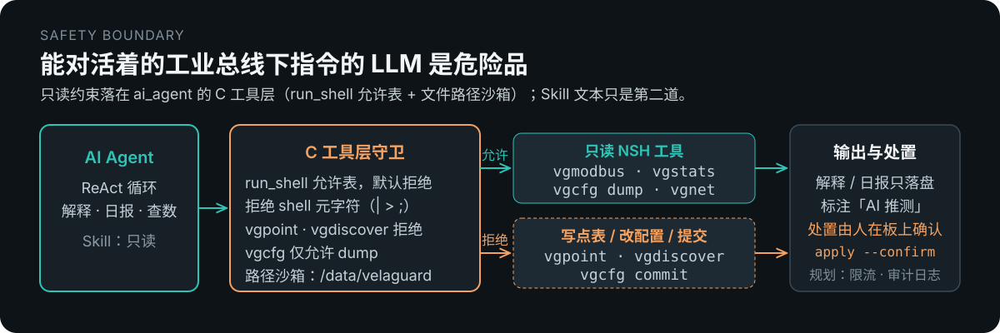

<p align="center">
  
</p>

<p align="center">
  <b>contest2026_004 · Team Falcons（FoLeaf）</b><br>
  赛道：AI 硬件产品创新 · 硬件：STM32H750B-DK · 系统：openvela / NuttX（<code>dev-ai-contest-2026</code>）
</p>

<p align="center">
  <a href="#评委速览">评委速览</a> ·
  <a href="#主动--执行agent-怎么工作">主动 + 执行</a> ·
  <a href="#功能清单与当前状态">功能清单</a> ·
  <a href="#构建烧录与运行">构建与运行</a> ·
  <a href="VelaGuard_项目手册.md">项目手册</a>
</p>

---

## 这是什么

**VelaGuard** 是一台独立运行在 **STM32H750B-DK + openvela** 上的 **RS485/Modbus 现场网关**。它的核心不是采集转发，而是**把已采集的数据讲给人听**。

采集、告警、帧统计、配置存储全部由板上确定性 C 代码完成，断网照常。板载 `ai_agent` 只做三件事：告警产生后自动解释、按时生成运营日报、用自然语言回答「5 号从站流量怎么样」。它**不写总线、不改配置、不替人做处置**，这条边界写在 ai_agent 的 C 工具层，不靠 prompt 自觉。

目标用户是要把设备接到陌生 485 总线上的嵌入式工程师、自动化调试与系统集成人员，不是产线操作工。

---

## 评委速览

| 项 | 内容 |
|----|------|
| 作品名称 | VelaGuard |
| 所属赛道 | AI 硬件产品创新（模式 B：LVGL 应用 + `ai_agent` 框架） |
| 队伍 | contest2026_004 · Team Falcons（GitHub：FoLeaf） |
| 硬件 / 系统 | STM32H750B-DK（Cortex-M7，固件从 QSPI XIP 执行）· openvela / NuttX |
| 交互渠道 | CLI（`vela>` 自然语言查数）+ LVGL 触控 HMI |
| 自定义 Skill | `/data/agent/skills/` 下 `alarm_interpretation.md`、`operations_report.md`、`modbus_query.md`，固件首启自动写入 |
| 主动 + 执行 | **事件主动**：本地告警 → Agent 解释落盘；**定时主动**：HEARTBEAT 每 30 分钟补生成当日日报 → LVGL 报告页 |
| openvela 能力落点 | 图形（LVGL HMI）+ AI（ai_agent）+ NuttX 串口 / 网络 / 块设备 |
| 运行方式 | [构建、烧录与运行](#构建烧录与运行)，板端验收命令在 `scripts/stage1_*_accept_nsh.txt` |
| 公共仓改动 | 直接改 nuttx / nuttx-apps / MQTT-C 树并 PR，不用 patch，见 [公共仓改动与 PR](#公共仓改动与-pr) |
| AI Coding 日志 | `logs/Foleaf/`，由官方归集工具生成，见 [AI Coding 日志](#ai-coding-日志) |
| 演示视频 / 作品介绍 | 按大赛要求随作品单独提交 |
| 许可证 | Apache-2.0，原创实现；第三方 nanoMODBUS 保留 MIT |

---

## 它解决什么问题

三个用户故事，对应三条主线：

1. **接入陌生总线**。集成工程师带着网关到现场柜子，不知道总线上有几个从站、什么地址、寄存器怎么解读。打开屏上「启用总线扫描」（默认关），`Scan Bus` 扫地址 1–32，探测寄存器块，生成候选点表，`测试读取` 通过后现场确认，曲线开始跑。全过程本地完成，不需要网络。
2. **夜里温度越限**。规则引擎在板上判定阈值 / 离线告警，屏幕和 LED 立刻报警，不等网络。联网时 Agent 在下一个 HEARTBEAT 周期读取告警上下文、通信质量和实时值，写出一份带证据的解释到 `reports/last_alarm.md`，标注「AI 推测」。工程师早上看到的是解释，不是一串原始数值。
3. **每天的运行概况**。Agent 按 `operations_report` Skill 汇总通信质量与关键指标，写入 `reports/daily-YYYYMMDD.md`，LVGL 报告页直接读取；随时可以在 `vela>` 用自然语言查当前读数。

| 能力 | 常见做法 | VelaGuard | 状态 |
|------|----------|-----------|------|
| 发现从站 | 手工试地址 × 波特率 | `vgdiscover` / HMI 扫描 @9600，地址 1–32 | 已落地（波特率矩阵为阶段 2） |
| 识别数据格式 | 试四种字序看哪个像 | int16 × 0.1 物理合理性筛选生成候选点表 | 基础版已落地；字序 / 倍率联合约束求解为阶段 2 |
| 理解告警 | 看原始数值自己猜 | Agent 自动解释，带 evidence，标「AI 推测」 | 已落地 |
| 运行概况 | 翻日志 / 手工统计 | Agent 定时生成日报 | 已落地（周报可后补） |
| 查当前读数 | 组态或串口助手 | `vela> ask` 自然语言提问 | 已落地 |
| 定位通信故障 | 老师傅经验 | 确定性归因规则库 | 阶段 2，规划中 |

---

## 系统形态

<p align="center">
  
</p>

**永远本地**（断网照常）：Modbus 周期采集、帧级质量统计、阈值 / 离线告警、屏幕与 LED 告警、双槽配置存储。

**需要网络**：Agent 解释与日报（LLM 在云端）、MQTT 状态上报。断网时 HMI 只显示规则引擎的原始信息，不假装还能 AI 诊断。

系统入口 `velaguard_app_main` 依次拉起：NSH 线程 → RJ45 / ESP-01S 热备管理 → eMMC 双槽配置 → Skill 写入与 LLM 凭据解密 → 本地告警检测器 → `ai_agent`（不带屏预设自动）→ LVGL HMI。采集与告警不依赖网络，也不依赖 Agent。

---

## 主动 + 执行：Agent 怎么工作

这是赛道的核心区分点。VelaGuard 的主动能力不是聊天，而是一条**文件链路**：确定性 C 代码产生事实，Agent 按 Skill 消费事实并落盘结果，人和屏幕再读结果。

### 事件主动：告警自动解释

```text
规则引擎判定阈值 / 离线告警（vg_alarm_eval.c，本地，不依赖网络）
→ 告警检测器写 /data/velaguard/pending_alarm.txt（vg_agent_alarm.c、HMI 后端）
→ ai_agent --daemon 每 30 分钟读 HEARTBEAT.md，发现 pending 告警
→ 按 alarm_interpretation Skill：vgstats dump / vgmodbus 读实时值 / vgcfg dump 取证据
→ 写 /data/velaguard/reports/last_alarm.md（纯文本：摘要 · 证据 · 建议关注）
→ 不清告警、不改配置；信息不足时 unresolved=true，不编造点位
```

### 定时主动：运营日报

```text
HEARTBEAT.md：若今日 daily-YYYYMMDD.md 不存在
→ 按 operations_report Skill：get_current_time 取日期，vgstats / vgmodbus / vgcfg dump 取指标
→ 写 /data/velaguard/reports/daily-YYYYMMDD.md（告警摘要 · 通信质量 · 关键指标 · 建议关注）
→ LVGL「报告」页自动挑最新一份显示
```

### 交互渠道：自然语言查数

`nsh> ai_agent` 进入 `vela>`，`ask 读取从站 1 的温湿度` 由 `modbus_query` Skill 转成 `vgmodbus -a 1 -r 0 -c 2 -n 1 -i 0` 只读命令并用自然语言回答。LVGL 首页 / 从站详情页显示同一份实时快照。

### Skill 与 HEARTBEAT

三个 Skill 和 `HEARTBEAT.md` 内嵌在固件里，首次启动写入 eMMC（`app/velaguard/vg_agent_seed.c`），之后可在板上直接编辑：

| 文件 | 触发 | 允许的工具 | 产出 |
|------|------|------------|------|
| `alarm_interpretation.md` | pending 告警 / 用户问告警含义 | `read_file`、`run_shell`（只读命令） | `reports/last_alarm.md` |
| `operations_report.md` | HEARTBEAT 发现今日无日报 / 用户要报告 | `get_current_time`、`run_shell` | `reports/daily-YYYYMMDD.md` |
| `modbus_query.md` | 用户问寄存器 / 温湿度 / 通信质量 | `run_shell`（`vgmodbus`、`vgstats`、`vgcfg dump`） | 自然语言回答 + 原始数值 |
| `HEARTBEAT.md` | 守护进程每 30 分钟 | 仅 `vgmodbus`、`vgstats`、`vgcfg dump`、`vgnet` | 上两项的周期性触发 |

### 板上演示（真实命令，来自 `scripts/stage1_agent_ops_accept_nsh.txt`）

```text
nsh> ls /data/agent/skills                 # 三个 Skill 由固件首启写入
nsh> ai_agent --daemon &                    # 守护：HEARTBEAT + cron（主线固件开机已自启，重跑有防重护栏）
nsh> ai_agent                               # 交互：附着到守护进程，进入 vela>
vela> ask 按 operations_report Skill 生成今日运营日报，写入 /data/velaguard/reports/
vela> quit
nsh> ls /data/velaguard/reports             # daily-YYYYMMDD.md
nsh> cat /data/velaguard/reports/daily-20260911.md

# 人工注入一条告警，验证事件主动链路（真实告警由规则引擎自动写入同一文件）
nsh> echo "type=threshold\nslave=1\nreg=0\nvalue=3500\nthreshold=3000" > /data/velaguard/pending_alarm.txt
nsh> ai_agent
vela> ask 按 alarm_interpretation Skill 解释 pending 告警
vela> quit
nsh> cat /data/velaguard/reports/last_alarm.md
```

可证伪目标（手册 §14.2）：告警解释被人工判定合理的比例 ≥ 70%；日报指标与板上数据一致的比例 ≥ 90%；全过程 Agent 触发写操作次数 = 0。

---

## Agent 安全边界

<p align="center">
  
</p>

一个能对活着的工业总线下指令的 LLM 是危险品，所以约束不放在 prompt 里，放在 `ai_agent` 的 C 工具层（`packages/ai_agent/src/tools/tool_shell.c`、`tool_files.c`）：

- `run_shell` 走允许表，默认拒绝；拒绝管道、重定向等 shell 元字符
- `vgpoint`、`vgdiscover` 一律拒绝；`vgcfg` 只放行 `dump`
- `read_file` / `write_file` 只能落在 `/data/agent` 与 `/data/velaguard` 之下
- Skill 与 `HEARTBEAT.md` 再写一遍只读约束，作为第二道

Agent 只产出解释与建议。点表写入、配置提交只能由人在板上执行 `vgdiscover apply --confirm` / `vgpoint apply --confirm`。手册中的调用限流、参数上界与审计日志为规划项，尚未实现。

---

## 功能清单与当前状态

| 领域 | 功能 | 状态 | 位置 |
|------|------|------|------|
| 总线接入 | `vgdiscover` @9600 扫描 1–32、寄存器块探测、候选点表、`test-read`、`apply --confirm` | 已落地 | `app/velaguard/vgdiscover.c`、`vg_point_table.c` |
| 总线接入 | LVGL 总线探查页，扫描开关默认关 | 已落地 | `gui/main/ui/pages/vg_page_discover.c` |
| 总线接入 | `vgpoint` 主机侧增改点表、测试读取、`apply --confirm`、`get` 读实时快照 | 已落地 | `app/velaguard/vgpoint.c` |
| 总线接入 | 字序 / 倍率联合约束求解、波特率矩阵 | 阶段 2 | 手册 §4.3、§5.1 |
| 采集与统计 | nanoMODBUS RTU 主站 `vgmodbus`；HMI 周期轮询并写实时快照 | 已落地 | `vg_modbus_read.c`、`vg_ui_backend_board.c` |
| 采集与统计 | 帧级质量统计：CRC / 超时 / 回显 / 延迟，按从站滑窗，`vgstats` | 已落地 | `vg_frame_stats.c` |
| 告警 | 阈值（warn / crit）与离线（滑窗失败率）判定，HMI 告警页 | 已落地 | `vg_alarm_eval.c`、`vg_page_alarm.c` |
| 告警 | 告警 → `pending_alarm.txt` 交 Agent 解释（事件主动） | 已落地 | `vg_agent_alarm.c` |
| 告警 | 告警页直接显示 Agent 解释 | 部分：当前显示本地规则摘要并标「规则摘要」，Agent 解释在 `last_alarm.md` | `vg_page_alarm.c` |
| 告警 | 485 故障归因规则库 | 阶段 2 | 手册 §5.8 |
| Agent | `ai_agent` 在 Cortex-M7 运行，CLI `vela>`，MiMo OpenAI 兼容 HTTPS 直连 | 已落地 | `packages/ai_agent`（fork 分支） |
| Agent | 3 个 Skill + `HEARTBEAT.md` 首启写入；日报落盘并在 LVGL 报告页显示 | 已落地 | `vg_agent_seed.c`、`vg_page_report.c` |
| Agent | C 工具层只读守卫：`run_shell` 允许表 + 文件路径沙箱 | 已落地 | `packages/ai_agent/src/tools/` |
| Agent | LLM 密钥加密存 eMMC（`vgprovision`），不进固件、不进 git | 已落地 | `vg_provision*.c`、`scripts/provision-llm-from-secrets.*` |
| Agent | 周报、调用限流 / 审计日志、云端 Bridge | 规划 | 手册 §5.6、§11 |
| HMI | LVGL 触控 HMI：首页 / 从站详情 / 告警 / 报告 / 总线探查；PC 模拟器与板端同源 | 已落地 | `gui/` |
| HMI | 趋势 / 诊断 / 日志 / 系统页 | 阶段 2（占位 toast） | `gui/main/ui/shell/vg_shell.c` |
| 网络 | RJ45 主 + ESP-01S 备：ping 判健康、热备切换、指数退避、稳定窗口回切 | 已落地 | `vg_net_mgr.c`、`vg_net_policy.c` |
| 网络 | MQTT 在线状态上报（retained + LWT，明文 1883，试验） | 已落地 | `vg_mqtt_session.c` |
| 网络 | MQTT 遥测 / 告警 / OTA 主题、MQTTS | 规划（合同已定） | `docs/velaguard-mqtt-contract.md` |
| 存储与启动 | eMMC（SDMMC1 + FAT）；双槽 + CRC32 + 单调序号配置存储 | 已落地 | `vg_config_store.c`、nuttx 板级 `stm32_sdmmc.c`（`velaguard/integration` 分支） |
| 存储与启动 | QSPI XIP 启动 + 片内 boot stub | 已落地 | nuttx PR #350、`scripts/qspi_boot_stub/` |
| 存储与启动 | MQTT-only OTA（下载到 eMMC → boot stub 烧写 QSPI） | 阶段 3 | `docs/adr/0005-mqtt-only-pull-based-ota.md` |
| 工程 | 6 个主机单测：网络策略 / 配置存储 / 帧统计 / 探查 / 点表 / 告警判定 | 已落地 | `app/velaguard/host_tests/` |

---

## 技术实现

### 用到的 ai_agent 能力

| ai_agent 能力 | VelaGuard 用法 |
|---------------|----------------|
| ReAct 循环 + 工具调用 | `run_shell` 调板上只读 NSH 工具（`vgmodbus`、`vgstats`、`vgcfg dump`、`vgnet`）；`read_file` / `write_file` 读写 `/data/velaguard` |
| Markdown Skill | 三个 Skill 由固件首启写入 `/data/agent/skills/`，可在板上修改 |
| HEARTBEAT 主动任务 | `--daemon` 每 30 分钟读 `HEARTBEAT.md`：有 pending 告警则解释，今日无日报则生成 |
| NSH 渠道 | `ai_agent` 进入 `vela>`；守护进程已在跑时自动附着，`quit` 只退出交互 |
| LLM 后端 | OpenAI 兼容 HTTPS 直连 MiMo；`set_llm` 一次性配置或 eMMC 加密 provision |
| 工具层扩展 | 团队在 `tool_shell.c` / `tool_files.c` 加入 VelaGuard 允许表与路径沙箱 |

### 用到的 openvela / NuttX 能力

| 能力 | 用法 |
|------|------|
| LVGL 图形栈 | 触控 HMI；LTDC 显示加速与 FT5x06 触摸性能改进（nuttx PR #353 / #354） |
| 串口子系统 | UART7 RS485 半双工 DIR 时序 → `/dev/rs485`（板级 pinmux，PR #351） |
| 网络栈 | STM32H7 ETH MII PHY 轮询（PR #352）、ESP8266 AT（nuttx-apps PR #119）、MQTT-C pal 钩子（PR #1）、mbedTLS |
| 块设备与文件系统 | SDMMC1 eMMC bring-up + FAT，自写板级 `stm32_sdmmc.c` |
| 启动 | QSPI XIP + 片内 boot stub（PR #350） |

### 软件分层

| 层 | 职责 | 代表模块 |
|----|------|----------|
| Application | 系统入口、现场 HMI | `velaguard_app_main`（`velaguard.c`）· `vghmi`（`gui/`） |
| ai_agent | ReAct、Skill、HEARTBEAT、HTTPS | `packages/ai_agent` |
| VelaGuard Service | 探查、采集、统计、告警、配置、网络、Agent 种子与守卫 | `vgdiscover` · `vgpoint` · `vgmodbus` · `vgstats` · `vgcfg` · `vgnet` · `vg_agent_*` |
| openvela / NuttX | 任务、文件系统、串口、以太网、LTDC | UART7(RS485) · ETH · SDMMC · LTDC |

---

## 构建、烧录与运行

前置：在 **openvela 工作区根目录**（含 `.repo/`）完成 `repo init -b dev-ai-contest-2026` 与 `repo sync`；Windows 侧安装 STM32CubeProgrammer（烧录经 WSL interop 调用）。

```bash
cd contest2026_004_TeamFalcons

# 1. 首次：把 nuttx / apps / MQTT-C 切到 VelaGuard feature 分支（只校验和 checkout，不 apply patch）
bash scripts/build.sh --sync-upstream

# 2. 构建作品主线 stm32h750b-dk:velaguard-lvgl（网络 + 带屏 + Agent）
bash scripts/build.sh                 # 产物：.debug/nuttx.hex + .debug/qspi_bootstub.hex
bash scripts/build.sh min             # 仅 bring-up（无网络、无屏），不是提交镜像

# 3. 烧录（QSPI XIP 需两份 HEX，脚本依次烧写；ST-LINK）
bash scripts/flash.sh

# 4. 写入 LLM 凭据（加密存 eMMC；secrets/ 已被 .gitignore 忽略）
#    secrets/agent_llm.key       ← MiMo token（大赛发放，仅限本赛事使用）
#    secrets/agent_llm.endpoint  ← https://token-plan-cn.xiaomimimo.com/v1
bash scripts/provision-llm-from-secrets.sh COM3
#    或在板上一次性配置：vela> set_llm https://token-plan-cn.xiaomimimo.com/v1 mimo-v2.5 <TOKEN>
```

上电后冷启动自动进入 LVGL 首页；串口 NSH（115200）可执行 `vgdiscover` / `vgcfg dump` / `ai_agent`。带屏主线固件开机自动拉起 Agent（HMI 之后延迟 3s 启动 `ai_agent --daemon`）；不带屏预设同样由固件自动拉起。

**板端验收脚本**（真实命令序列）：`scripts/stage1_modbus_discovery_accept_nsh.txt`（总线探查）、`stage1_lvgl_hmi_accept_nsh.txt`（HMI）、`stage1_agent_accept_nsh.txt`（Agent + LLM）、`stage1_agent_ops_accept_nsh.txt`（Skill 与主动任务）；对应 `.ps1` 可自动走串口执行。

**没有真实传感器时**：用 Modbus Slave 在 PC 上模拟 32 个从站，`scripts/build_velaguard_mbslave.ps1`，点表见 `config/modbus-slave/README.md`。

**PC 模拟器**（与板端 HMI 同源）：

```bash
bash gui/scripts/setup_gui.sh
cmake -S gui -B gui/build -DCMAKE_BUILD_TYPE=Debug && cmake --build gui/build -j$(nproc)
./gui/bin/main
```

**主机单测**：

```bash
make -C app/velaguard/host_tests test
```

---

## 公共仓改动与 PR

按大赛规则，公共仓改动在 nuttx / nuttx-apps / MQTT-C 的 git 树上直接修改并 PR 到 `dev-ai-contest-2026`，本仓**不使用 patch**；`build.sh` 只校验这些树已包含 VelaGuard 改动。

| 仓库 | 分支 | PR |
|------|------|-----|
| open-vela/nuttx | `velaguard/qspi-boot-stm32h750b-dk` | [#350](https://github.com/open-vela/nuttx/pull/350) |
| open-vela/nuttx | `velaguard/board-and-defconfigs` | [#351](https://github.com/open-vela/nuttx/pull/351) |
| open-vela/nuttx | `velaguard/eth-mii-stm32h750b-dk` | [#352](https://github.com/open-vela/nuttx/pull/352) |
| open-vela/nuttx | `velaguard/display-acceleration-stm32h750b-dk` | [#353](https://github.com/open-vela/nuttx/pull/353) |
| open-vela/nuttx | `velaguard/ui-performance-stm32h750b-dk` | [#354](https://github.com/open-vela/nuttx/pull/354) |
| open-vela/nuttx-apps | `velaguard/netinit-esp8266` | [#119](https://github.com/open-vela/nuttx-apps/pull/119) |
| open-vela/apps_netutils_mqttc_MQTT-C | `velaguard/mqtt-pal-hook` | [#1](https://github.com/open-vela/apps_netutils_mqttc_MQTT-C/pull/1) |

Fork：`FoLeaf/nuttx`、`FoLeaf/nuttx-apps`、`FoLeaf/apps_netutils_mqttc_MQTT-C`；本地集成分支 `nuttx/velaguard/integration` 仅开发用。

首次向仓库提 PR 会触发 `cla/signature` 检查：先在 [openvela 官网签署 CLA](https://openvela.com/#/community/cla)，再在原 PR 下评论 `/check-cla` 复检。

---

## AI Coding 日志

路径 `logs/Foleaf/`，由官方 `contest-log-collector` 在工作区内自动归集，按 `<date>/<tool>__<sid>.jsonl` 存放，`manifest.json` 为索引。会话按真实来源标注 `claude-code` / `codex` / `opencode`，团队采集器另以 `cursor` / `grok-build` 诚实标签收录 Cursor 与 Grok Build 会话；JSONL 正文不做改写。提交前用官方校验器自检：

```bash
python3 ../.claude/skills/contest-log-collector/tools/validate-log.py logs/
```

---

## 文档导航

| 文档 | 内容 |
|------|------|
| [`VelaGuard_项目手册.md`](VelaGuard_项目手册.md) | 产品边界、模块细则、HMI、存储、验收与架构决策（权威） |
| [`VelaGuard_推进方案.md`](VelaGuard_推进方案.md) | 被推翻的决策与理由、阶段计划 |
| [`CONTEXT.md`](CONTEXT.md) | 领域术语 |
| [`docs/agents/BOUNDARY.md`](docs/agents/BOUNDARY.md) | 赛题与本地边界（官方规则优先） |
| [`docs/adr/`](docs/adr/) | 架构决策记录 |
| [`docs/velaguard-expansion-board.md`](docs/velaguard-expansion-board.md) | 扩展板接线：UART7 RS485、STMod+ ESP-01S、DO |
| [`docs/velaguard-mqtt-contract.md`](docs/velaguard-mqtt-contract.md) | MQTT 主题与鉴权合同 |
| [`docs/stm32h750b_dk_qspi_xip_deep_dive.md`](docs/stm32h750b_dk_qspi_xip_deep_dive.md) | QSPI XIP 启动与 boot stub |
| [`docs/velaguard-bringup-known-issues.md`](docs/velaguard-bringup-known-issues.md) | Bring-up 已知问题与修复 |
| [`gui/README.md`](gui/README.md) | HMI 模拟器与板端构建 |

Modbus 状态机、告警模型、MQTT QoS、启动顺序细节以手册正文为准。

---

## 许可证

Apache License 2.0。作品为原创实现；第三方组件保留其自身许可证（`app/velaguard/nanomodbus/` 为 MIT）。
