# VelaGuard 项目手册 — Mermaid 图表总览

> 基于 `VelaGuard_项目手册.md` v2（2026-08-20 设计评审后重写）整理

---

## 1. 系统整体形态

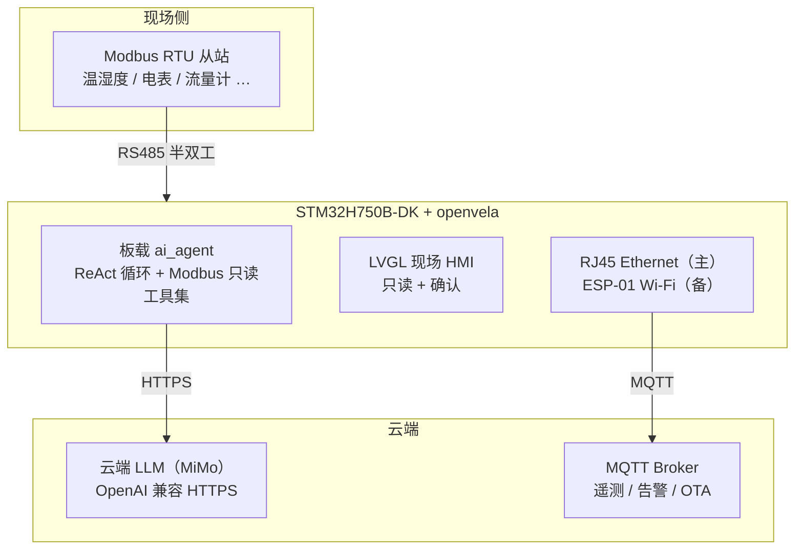

---

## 2. 软件分层架构

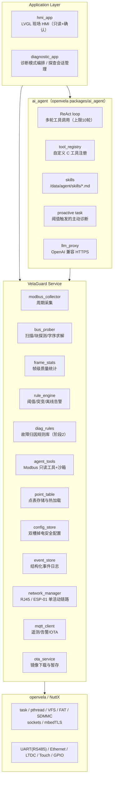

---

## 3. Agent 与确定性逻辑的分工

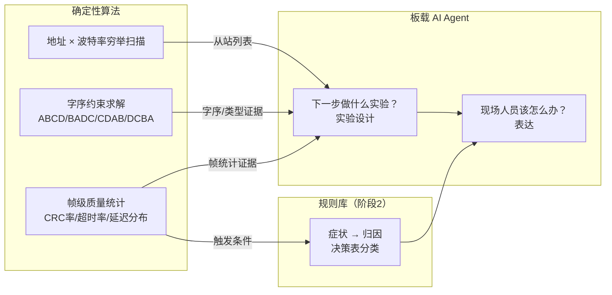

---

## 4. 字序与数据类型约束求解流程

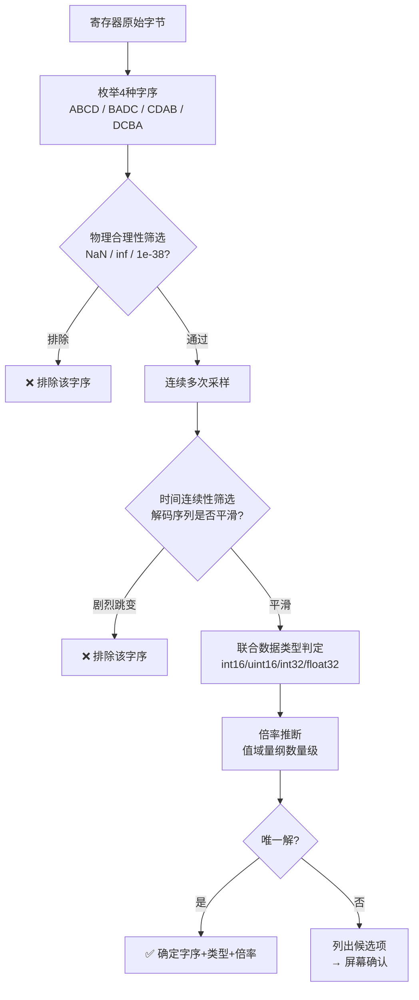

---

## 5. 主动诊断会话流程

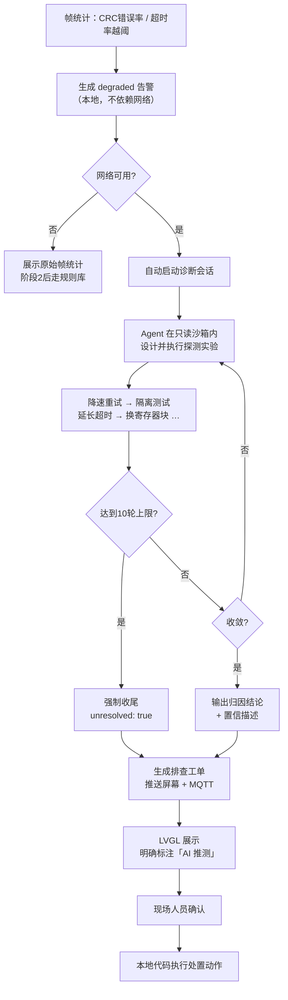

---

## 6. Agent 工具沙箱与权限边界

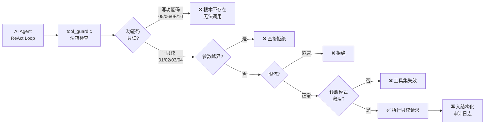

---

## 7. Agent 输出处置流程

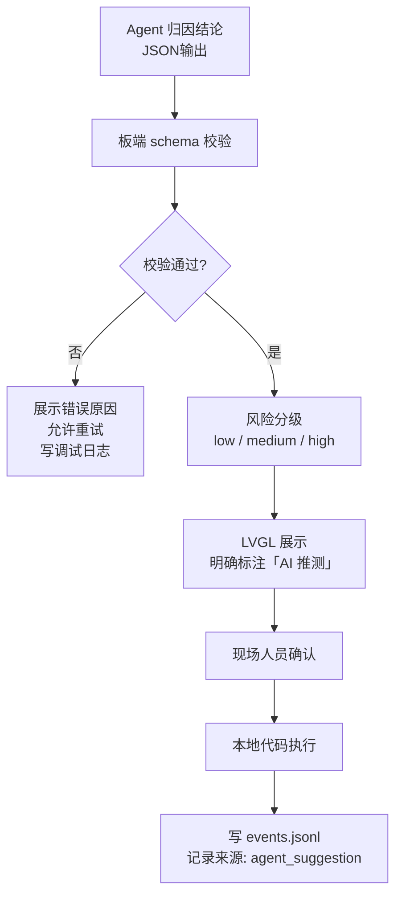

---

## 8. OTA 升级架构（XIP 约束下）

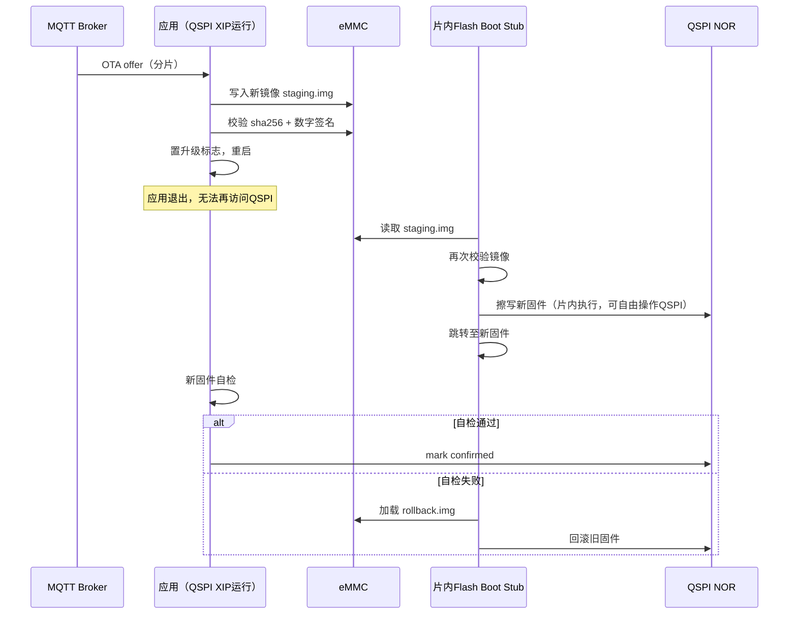

---

## 9. 启动顺序

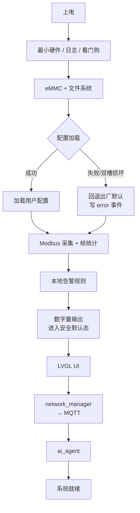

---

## 10. 网络状态机

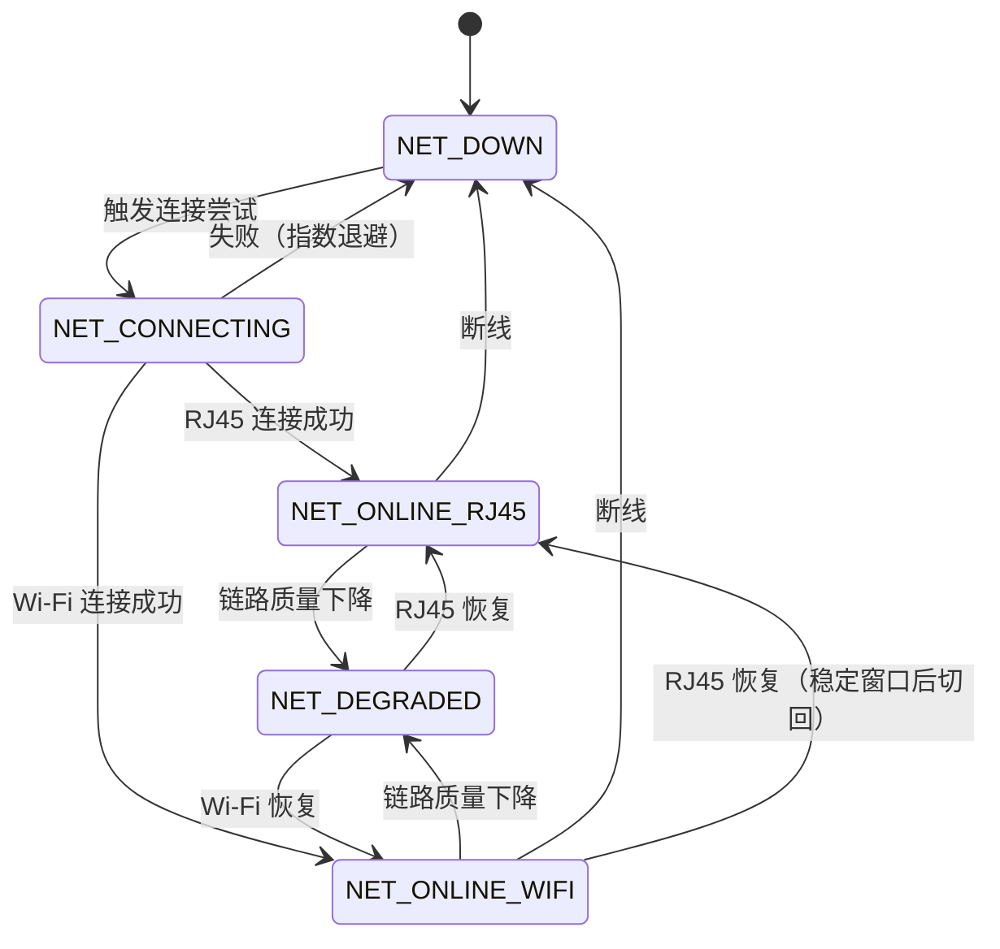

---

## 11. Modbus 通信状态机

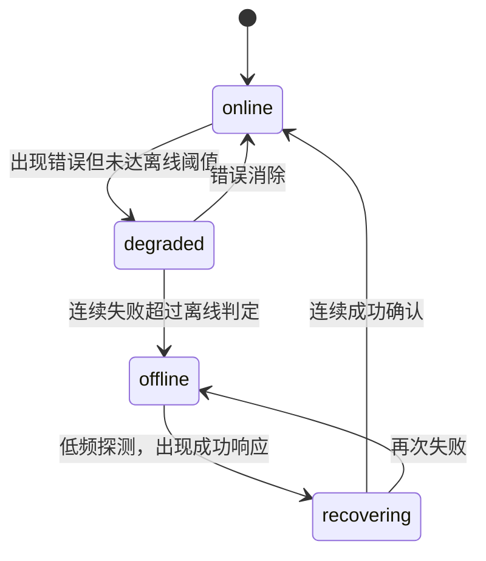

---

## 12. HMI 页面结构

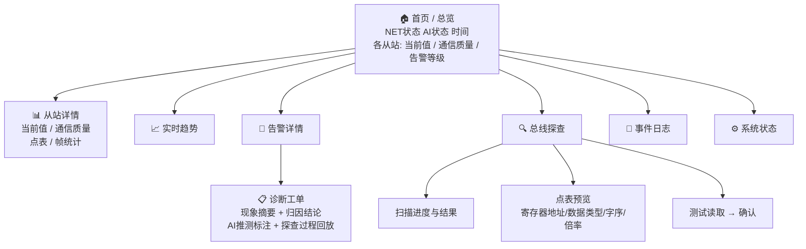

---

## 13. 存储布局

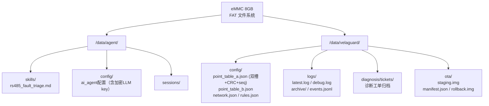

---

## 14. 故障归因规则库（阶段2）

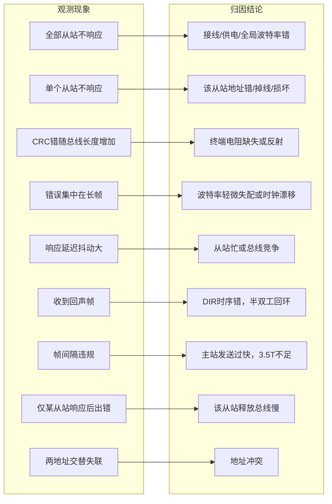

---

## 15. 联网/离线能力边界

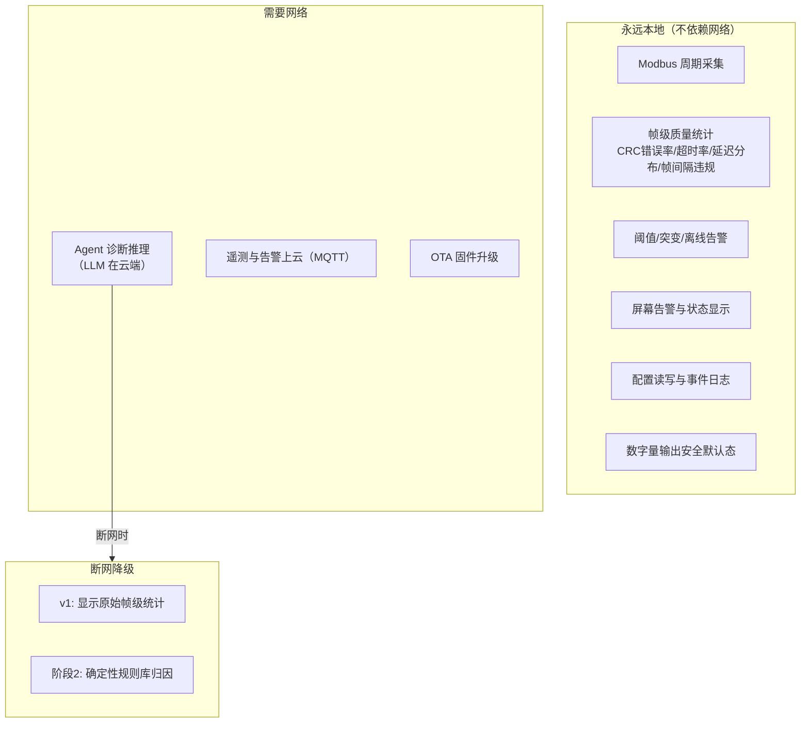

---

## 16. MQTT Topic 结构与 QoS

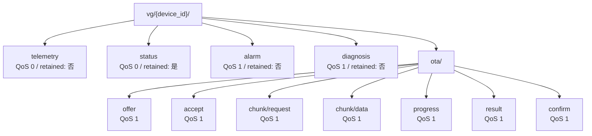

---

## 17. 大赛验收要求对照

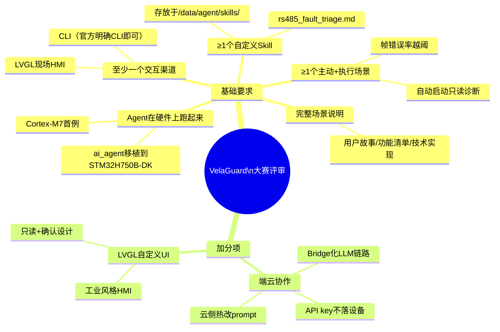