# VelaGuard

> **团队**：contest2026_004 Team Falcons（FoLeaf）  
> **赛道**：AI 硬件产品创新  
> **硬件**：STM32H750B-DK + VelaGuard 扩展板（RS485 / RJ45 / ESP-01 备链 / LTDC 触控）  
> **手册**：完整产品与架构说明见 [`VelaGuard_项目手册.md`](VelaGuard_项目手册.md)（v3 · 2026-08-29）

**一句话**：运行在 openvela 上的 RS485/Modbus 现场网关。采集、告警与统计全部由本地确定性逻辑完成；板载 `ai_agent` 做运营助手——告警自动解释、日报/周报，以及自然语言查实时数据。

---

## 它解决什么问题

把一台设备接到陌生 485 总线上，工程师通常要手工试地址与波特率、人肉猜字序与倍率、对着告警数值自己脑补含义。VelaGuard 把前半段交给扫描与约束求解，把「对人意味着什么」交给板载 Agent：

| 能力 | 常见做法 | VelaGuard |
|------|----------|-----------|
| 发现从站 | 手工试地址 × 波特率 | 自动扫描矩阵 |
| 识别数据格式 | 试四种字序看哪个像 | 物理合理性 + 时间连续性约束求解 |
| 定位通信故障 | 老师傅经验 | 确定性规则库（阶段 2，不依赖 Agent） |
| 理解告警 | 看原始数值自己猜 | Agent 自动解释（标注「AI 推测」） |
| 运行概况 | 翻日志 / 手工统计 | Agent 定时生成日报/周报 |
| 查当前读数 | 组态或串口助手 | 自然语言提问（CLI / LVGL） |

目标用户是和作者同类的嵌入式工程师、自动化调试与系统集成人员——**不面向**产线操作工；Agent **不做**总线排障实验设计。

---

## 系统形态

独立网关，不依赖长期连接电脑。USB CDC / UART 只作开发调试与救援通道。

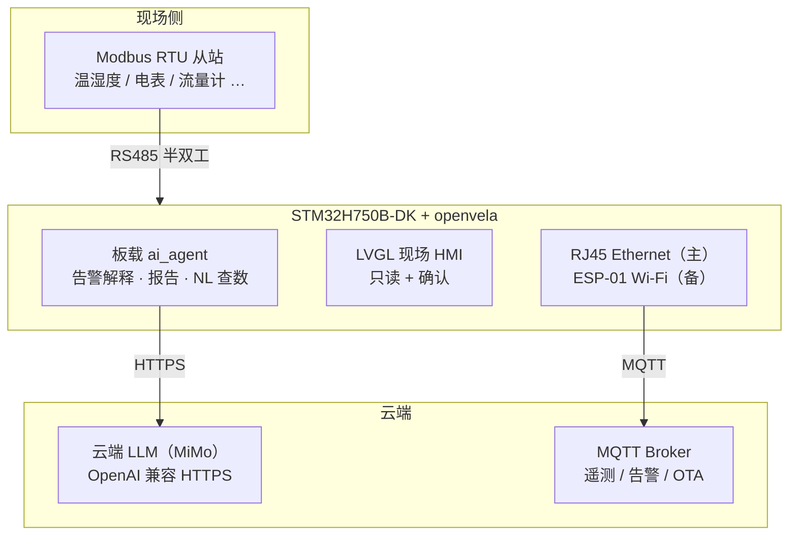

**永远本地（断网也继续）**：Modbus 周期采集、帧级质量统计、阈值/突变/离线告警、屏幕告警、配置与事件日志、数字量输出安全默认态。  
**需要网络**：Agent 解释与报告（LLM 在云端）、遥测上云、OTA。断网时展示规则引擎原始信息，不假装还能「AI 诊断」。

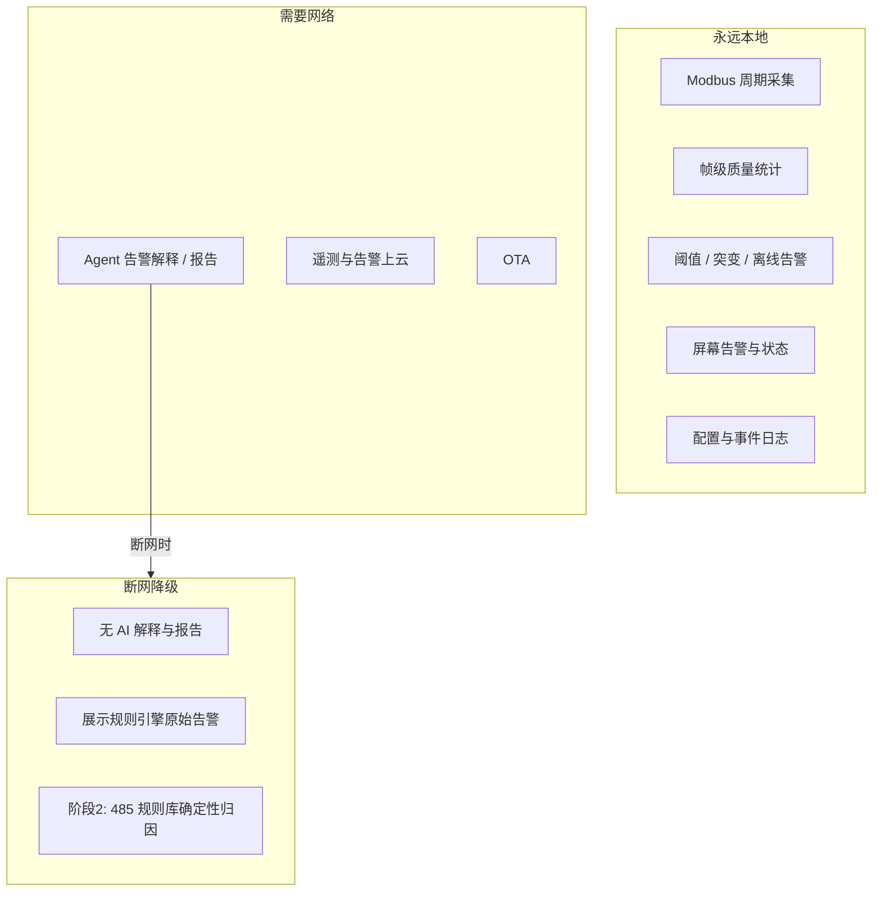

---

## 软件分层

应用层只管「给人看 / 给人确认」；真正的采集与安全边界在 VelaGuard Service；Agent 只能通过只读工具碰已采集数据。

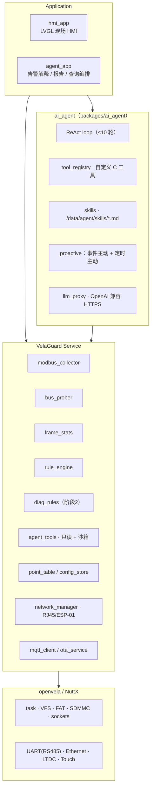

### Agent 与确定性逻辑怎么分工

这是架构核心：**穷举、约束求解、统计、485 归因走确定性路径；解释与汇总才走 Agent。**

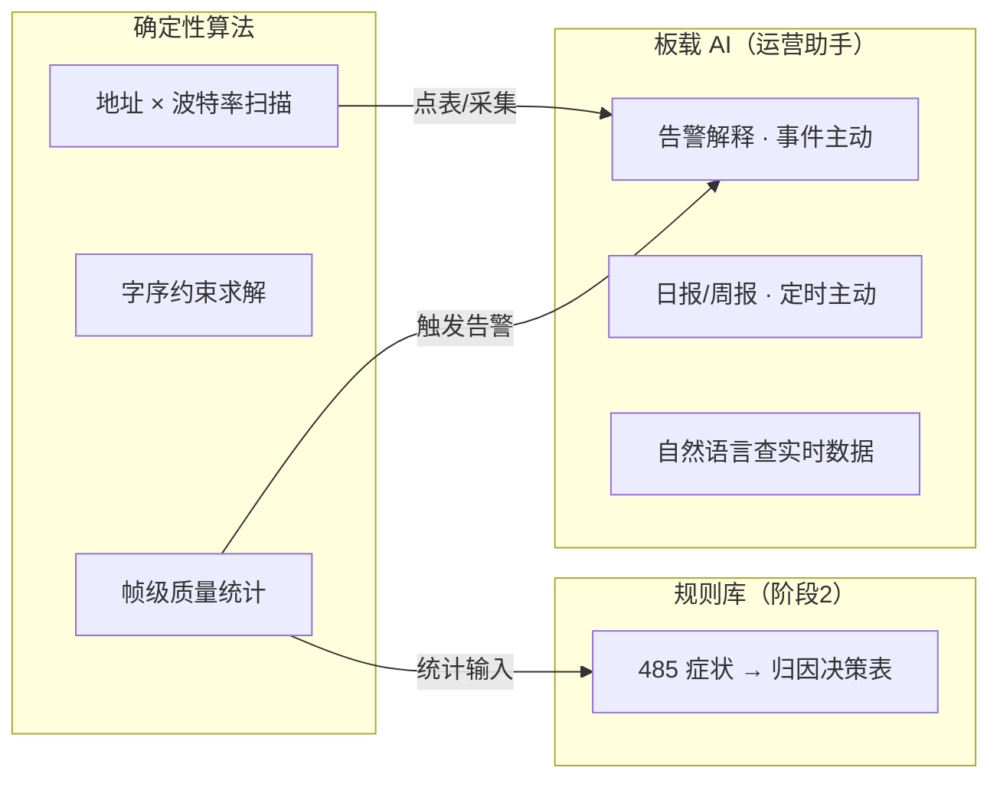

字序求解不用 LLM：枚举 ABCD/BADC/CDAB/DCBA → 物理合理性筛选（NaN/inf 等）→ 时间连续性筛选 → 联合判定类型与倍率；唯一解直接落点表，否则列出候选交屏幕确认。

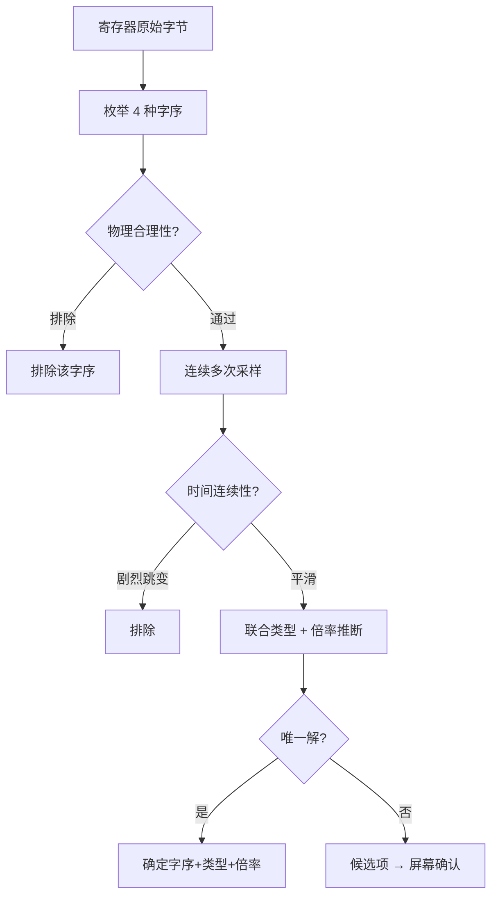

---

## 典型场景（图文）

### 接入陌生总线

接上 485 →「Scan Bus」→ 扫描地址 × 波特率 → 探测寄存器块 → 约束求解推断类型/字序/倍率 → 点表预览 → 测试读取 → 人工确认 → 进入采集循环。探查与求解全部本地、不依赖网络。

### 告警自动解释（事件主动）

规则引擎先在本地弹出告警；联网时自动启动解释会话，Agent 用只读工具拉上下文，输出摘要 + evidence，UI 标注「AI 推测」。**不自动清告警、不改配置。**

### 日报 / 周报（定时主动）

定时器到点后汇总窗口内告警与指标，报告写入 `/data/velaguard/reports/`，LVGL 报告页可预览。9/20 里程碑以日报为必做，周报可后补。

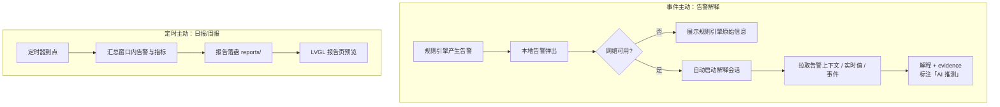

自定义 Skill：`alarm_interpretation.md`、`operations_report.md`（`/data/agent/skills/`）。交互渠道另支持 CLI / LVGL 自然语言查数（如「5 号从站流量怎么样？」），满足赛道交互要求；主场景仍是上面两类主动能力。

---

## Agent 安全边界

能对活着的工业总线下指令的 LLM 是危险品。边界写在 **C 工具注册层**，不依赖 prompt：

- 工具集只读：无 Modbus 写、无总线探测实验类操作
- 地址、时间窗口、点位数量有硬上界；单位时间限流
- 按会话类型门控；每次调用写审计日志
- Agent 只产出解释与建议；处置须人工确认后由本地代码执行

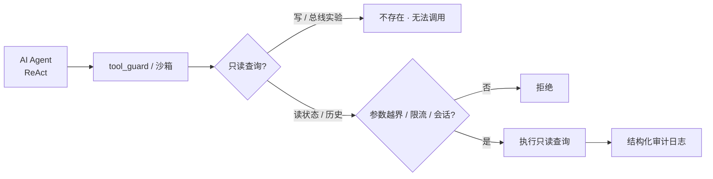

输出侧：schema 校验 → 风险分级 → LVGL 展示（「AI 推测」）→ 现场确认 → 本地代码执行 → `events.jsonl` 记 `agent_suggestion`。

---

## 网络、启动与 OTA

`network_manager` 管理 **单活动链路**：RJ45 优先，故障切 ESP-01，RJ45 恢复并经稳定窗口后再切回。指数退避重连。该模块已基本建成并进入冻结维护。

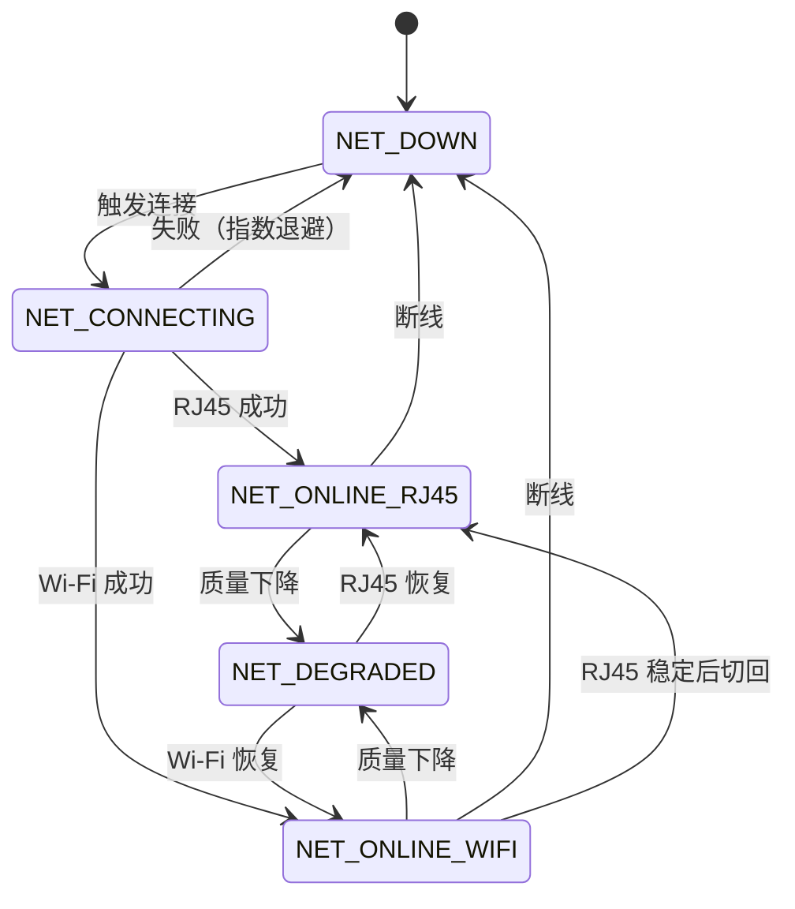

启动顺序保证「先本地安全环、后网络与 Agent」：硬件/看门狗 → eMMC → 配置双槽 → 采集与帧统计 → 告警规则 → DO 安全默认 → LVGL → 网络/MQTT → ai_agent。

固件从 QSPI **XIP** 执行，运行期不能擦写 QSPI。OTA 因此改为：应用把镜像落到 eMMC → 重启 → 片内 boot stub 校验并烧写 QSPI → 自检确认或回滚。

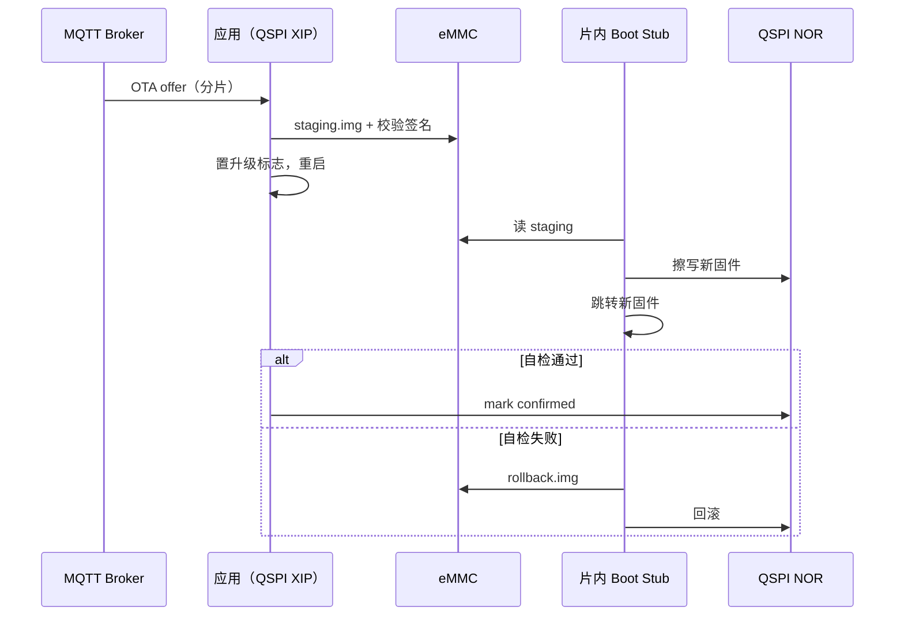

MQTT 主题形如 `vg/{device_id}/telemetry|status|alarm|diagnosis|ota/...`；不再承载已移除的语音/TTS 路径。详情与 QoS 见项目手册 §8 / §16。

---

## 现场 HMI

PC 模拟器源码在 [`gui/`](gui/)（自 [FoLeaf/velaguard_gui](https://github.com/FoLeaf/velaguard_gui) 迁入，按手册 §6 裁剪）。WSL 构建见 [`gui/README.md`](gui/README.md)；Windows 见 `gui/README_CN.md`。

原则：**只读 + 确认，屏上不做编辑。** 告警与报告入口比配置更突出；「AI 推测」与「确定性结论」视觉上必须区分。总线扫描 **UI 开关默认关闭**。

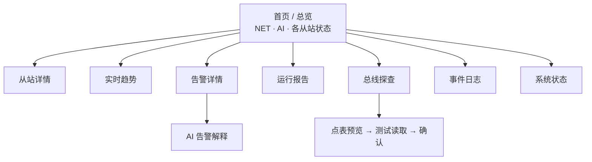

持久化落在板载 8 GB eMMC（FAT）：`/data/agent/`（Skill、会话）、`/data/velaguard/`（点表双槽、日志、`reports/`、OTA staging）。配置写入用双槽 + CRC + 单调序号对抗 FAT 非掉电安全。

---

## 大赛赛道对照

| 官方要求 | 本项目落点 |
|----------|------------|
| Agent 在设备上跑起来 | `packages/ai_agent` 移植到 STM32H750B-DK（Cortex-M7） |
| ≥1 交互渠道 | CLI（`vela>`）+ LVGL |
| ≥1 自定义 Skill | `alarm_interpretation.md`、`operations_report.md` |
| ≥1 主动 + 执行 | **事件主动**告警解释；**定时主动**日报/周报 |
| openvela 能力 | LVGL HMI、ai_agent + 云端 MiMo、触控 UI |
| 加分：端云协作 | Bridge 化 LLM（后续增强） |
| 加分：自定义 UI | 工业风格只读+确认 HMI |

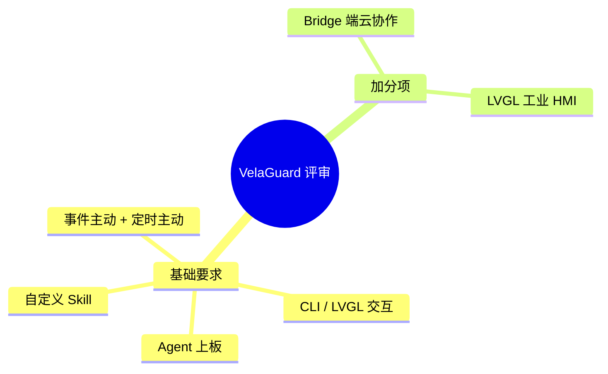

可证伪目标（手册 §14.2）：告警解释合理率 ≥ 70%；日报指标一致率 ≥ 90%；全过程写操作触发次数 = 0。

权威规则以官方赛道文档为准；本地边界见 [`docs/agents/BOUNDARY.md`](docs/agents/BOUNDARY.md)，术语见 [`CONTEXT.md`](CONTEXT.md)。

---

## 构建与烧录

在 **openvela 工作区根目录**（含 `.repo/` 的父目录）同步 manifest 后，于本仓执行：

```bash
cd contest2026_004_TeamFalcons
bash scripts/build.sh min    # 最小 bring-up（无网络）
bash scripts/build.sh net    # 完整网络 + MQTT + ESP8266 备链
```

产物：`contest2026_004_TeamFalcons/.debug/nuttx.hex` 与 `qspi_bootstub.hex`（QSPI XIP 启动需两份 HEX 依次烧录）。

**公共仓依赖**：改动在 nuttx / nuttx-apps / MQTT-C 的 feature 分支上，**不再使用 patch**。构建前 `build.sh` 会校验本地树是否包含这些改动；若未切换分支：

```bash
bash scripts/build.sh --sync-upstream net
# 或手动：
#   git -C ../nuttx checkout velaguard/integration
#   git -C ../apps checkout velaguard/netinit-esp8266
#   git -C ../apps/netutils/mqttc/MQTT-C checkout velaguard/mqtt-pal-hook
```

### 公共仓 PR

| 仓库 | 分支 | PR | CI |
|------|------|-----|-----|
| open-vela/nuttx | `velaguard/qspi-boot-stm32h750b-dk` | https://github.com/open-vela/nuttx/pull/350 | ✅ |
| open-vela/nuttx | `velaguard/board-and-defconfigs` | https://github.com/open-vela/nuttx/pull/351 | ✅ |
| open-vela/nuttx | `velaguard/eth-mii-stm32h750b-dk` | https://github.com/open-vela/nuttx/pull/352 | ✅ |
| open-vela/nuttx | `velaguard/display-acceleration-stm32h750b-dk` | https://github.com/open-vela/nuttx/pull/353 | ✅ |
| open-vela/nuttx | `velaguard/ui-performance-stm32h750b-dk` | https://github.com/open-vela/nuttx/pull/354 | ✅ |
| open-vela/nuttx-apps | `velaguard/netinit-esp8266` | https://github.com/open-vela/nuttx-apps/pull/119 | ✅ |
| open-vela/apps_netutils_mqttc_MQTT-C | `velaguard/mqtt-pal-hook` | https://github.com/open-vela/apps_netutils_mqttc_MQTT-C/pull/1 | ✅ |

Fork：`FoLeaf/nuttx`、`FoLeaf/nuttx-apps`、`FoLeaf/apps_netutils_mqttc_MQTT-C`。本地集成分支（仅开发用）：`nuttx/velaguard/integration`。

---

## AI Coding 日志

路径：`logs/Foleaf/`（已索引会话经 `validate-log.py` 校验；本地 schema 已收录 `cursor` / `grok-build`，以诚实标签入索引）。

```bash
python3 ../.claude/skills/contest-log-collector/tools/validate-log.py logs/
```

---

## 更多文档

| 文档 | 内容 |
|------|------|
| [`VelaGuard_项目手册.md`](VelaGuard_项目手册.md) | 产品边界、模块细则、HMI、存储、验收与架构决策 |
| [`CONTEXT.md`](CONTEXT.md) | 领域术语 |
| [`docs/agents/BOUNDARY.md`](docs/agents/BOUNDARY.md) | 赛题与本地边界 |
| [`app/velaguard/README.md`](app/velaguard/README.md) | 应用目录说明 |
| [`board/contest_board/README.md`](board/contest_board/README.md) | 扩展板相关说明 |

手册中另有 Modbus 通信状态机、故障归因决策表、启动顺序细节、MQTT QoS 等，评审与实现以手册正文为准；本 README 只保留导航级图文。
